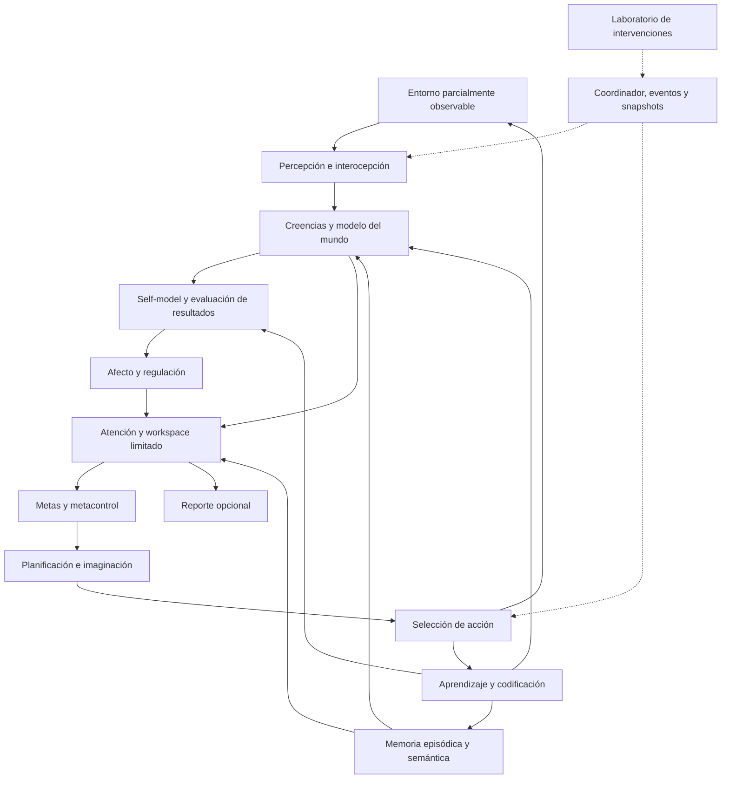

# Arquitectura conceptual de PROJECT CONSCIOUSNESS

Versión conceptual 0.1 · estado de implementación actualizado 2026-10-05 · arquitectura ampliada propuesta. La [entrega ejecutable v0.1](mvp-v0.1.md) implementa el primer corte de persistencia y memoria causal; [v0.2](mvp-v0.2.md) añade aprendizaje de asociaciones y reversión; [v0.3](mvp-v0.3.md) añade un predictor operativo de eficacia de dos herramientas. El resto de esta arquitectura permanece propuesto.

## 1. Pregunta y alcance

¿Qué combinaciones de memoria, modelos de sí mismo, acceso compartido a información y control adaptativo permiten continuidad, autorregulación y decisiones sensibles al contexto? ¿Qué cambia causalmente cuando se interviene uno de esos mecanismos?

La unidad de investigación es una trayectoria de un agente situado en un entorno parcialmente observable. Una respuesta convincente del agente no constituye el resultado principal. Se medirán elecciones, predicciones previas al resultado, recuperación de experiencias, transferencia y adaptación bajo intervención.

Distinciones de vocabulario:

- **Acceso funcional:** una representación puede influir en varios consumidores, dentro de presupuestos definidos.
- **Self-model:** modelo revisable de capacidades, recursos, historial y efectos de las acciones del propio agente.
- **Metacognición funcional:** estimar la calidad de sus propias predicciones y cambiar el procedimiento de decisión.
- **Afecto computacional:** variables de control que modulan atención, memoria, esfuerzo y selección de acción; sus nombres no atribuyen sentimientos.
- **Agencia:** seleccionar y mantener metas, actuar y revisar planes a partir de consecuencias en un dominio delimitado.
- **Conciencia fenomenológica:** que exista algo que se sienta al ser ese sistema. El laboratorio no dispone de una variable observada que determine esto.

Las etiquetas epistemológicas comunes son **E** (hallazgo empírico con población y alcance), **T** (teoría científica), **I** (decisión o hipótesis de ingeniería), **F** (posición o pregunta filosófica) y **U** (afirmación sin respaldo suficiente). Toda la arquitectura descrita a continuación es **I**, incluso cuando se inspira en **E/T**. La correspondencia con literatura está en [fundamentos](scientific-foundations.md).

## 2. Principios de diseño

1. El estado funcional vive en estructuras persistentes, versionadas y consultables. El contexto de un modelo lingüístico no será la única memoria.
2. Cada estado tiene un propietario, una regla de actualización y consumidores definidos. Una variable sin efecto verificable se considera telemetría o una hipótesis fallida, no un mecanismo cognitivo demostrado.
3. Las decisiones se registran antes de recibir el resultado. Explicaciones posteriores se evalúan por separado.
4. Se diferencian observaciones, inferencias, simulaciones, informes de terceros e intervenciones del investigador.
5. Se puede congelar, sustituir, permutar, retirar o restaurar un mecanismo. Se registran tanto los resultados favorables como los nulos.
6. Las afirmaciones científicas se limitan a las tareas, implementaciones y distribuciones ensayadas. Un componente inspirado en GNW o HOT no equivale a implementar o verificar íntegramente esas teorías.
7. El tiempo lógico y los recursos son explícitos: una pausa del proceso no genera vivencias ni aprendizaje implícito.

## 3. Organización general

Se propone un monolito modular con un coordinador y un único escritor de estado por ejecución. Inicialmente todos los componentes corren en un proceso. Los límites de módulos son interfaces de datos, no microservicios.

Las flechas de aprendizaje cierran ciclos entre instantes. El orden exacto dentro de cada tick evita que un componente use resultados futuros. El laboratorio tiene acceso al estado real del entorno para evaluar; el agente recibe únicamente observaciones permitidas por el contrato.

## 4. Componentes cognitivos y rutas causales

| Componente | Estado propio | Entrada → salida | Efecto observable propuesto |
|---|---|---|---|
| Percepción | Historial corto, fiabilidad estimada por canal | Observación → rasgos con incertidumbre y procedencia | Ruido o pérdida de canal altera actualización de creencias |
| Interocepción y recursos | Energía medida, presupuesto restante, límites | Recursos del cuerpo simulado → señales internas | Un coste real reduce acciones factibles; una estimación puede ser errónea |
| Modelo del mundo | Creencias sobre variables ocultas; parámetros de transición/observación | Evidencia + acción anterior → posterior y predicciones | Predicción de consecuencias y búsqueda de información |
| Memoria | Episodios, hechos derivados, índices, reglas de retención | Consulta/codificación → recuerdos con fuentes | Uso de una pista de otra sesión; cambio medible al retirar su lectura |
| Self-model | Probabilidades de éxito propias, límites, atribución de acción, continuidad de identidad | Historial propio + resultado → capacidad estimada | Delegar, verificar o evitar acciones según capacidad aprendida |
| Afecto/regulación | Valencia, activación, presión de recursos; constantes temporales | Error de predicción, costes, progreso → moduladores | Cambios de saliencia, umbral de riesgo y esfuerzo |
| Atención/workspace | Ganadores, antigüedad, capacidad, consumidores autorizados | Candidatos → conjunto pequeño publicado | Información local se vuelve utilizable por planificación y memoria |
| Gestor de metas | Metas, prioridad, progreso, condiciones de cierre | Necesidades + tareas + novedad → agenda | Persistir, suspender o reemplazar metas con trazabilidad |
| Metacontrol | Calibrador, historial de errores, política de presupuesto | Confianza y coste → actuar/verificar/recordar/deliberar | Menos errores costosos pagando un coste de información |
| Imaginación/planificador | Modelos y caché derivada de rollouts | Creencia + candidatos → trayectorias y valores estimados | Evitar una secuencia mala antes de ejecutarla |
| Política/actuación | Política versionada, intención pendiente | Plan + restricciones → acción válida | Cambia el entorno con resultado verificable |
| Aprendizaje/consolidación | Estadísticas, versiones y cola de actualización | Transiciones observadas → cambios candidatos | Adaptación a nuevas contingencias y retención de anteriores |
| Reporte | Proyección de trazas; sin autoridad sobre el núcleo | Estado publicable → explicación/tabla/texto | Fidelidad al registro; funcionamiento cognitivo sin reporte |

La identidad estable es una clave de continuidad del registro. La narrativa autobiográfica es una proyección revisable que cita episodios; no puede reescribir hechos históricos. La autoconciencia narrativa y la capacidad de estimar éxito son fenómenos funcionales distintos y se ensayan por separado.

## 5. Estado y dinámica

Definir el estado del agente en una frontera de tick como:

`S_t = (B_t, M_t, W_t, X_t, V_t, G_t, C_t, Θ_t, Q_t)`

Aquí `B` son creencias, `M` memoria, `W` workspace, `X` self-model, `V` reguladores afectivos, `G` metas, `C` metacontrol, `Θ` parámetros aprendidos y `Q` recursos internos. El estado del entorno `Z_t` se almacena aparte y nunca se incorpora a `S_t` por comodidad del programador.

`(S_(t+1), a_t, trace_t) = F(S_t, o_t, u_t, rng_t, config)`

`u_t` contiene intervenciones explícitas del investigador. Esta es una especificación de transición, no una ecuación neuronal. La continuación del entorno se calcula como `Z_(t+1) = Env(Z_t, a_t, noise_t)` y produce la observación del siguiente tick.

Separar cuatro conceptos: recurso real, estimación del recurso, valoración del recurso y reporte lingüístico del recurso. Al intervenir valencia se mantienen constantes el recurso real y la recompensa externa. Al intervenir una creencia sobre energía se documenta que el estado puede resultar artificial o fuera de distribución.

## 6. Ciclo cognitivo activo

Esta sección describe el ciclo objetivo ampliado. Los cortes ejecutables v0.1–v0.3 fijan la decisión, ejecutan la transición y asimilan el feedback dentro de un único tick transaccional; no dejan feedback pendiente entre ticks. v0.3 añade al último paso la actualización de la eficacia de la herramienta utilizada, sin modificar la predicción ya registrada.

En `t=0` se entrega una observación inicial; no existe resultado de acción previa. Para cada tick posterior:

1. **Recibir:** tomar `o_t`, resultado de `a_(t-1)` y señales internas disponibles; validar origen, secuencia y duplicados.
2. **Comparar y actualizar:** puntuar la predicción registrada en `t-1`; actualizar creencias, estadísticas propias y reguladores usando solamente evidencia disponible hasta `t`.
3. **Recuperar:** formular consultas desde observaciones y metas. Recuperar un conjunto acotado con fuentes, tipo y tiempo. No consultar snapshots del evaluador.
4. **Competir y publicar:** ordenar candidatos por relevancia, novedad y prioridad interna; publicar hasta `k` elementos y caducar contenidos antiguos. Mantener rutas locales explícitas para evaluar qué añade el broadcast.
5. **Gestionar metas:** revisar factibilidad, progreso y conflictos; seleccionar una meta activa dentro de las restricciones del experimento.
6. **Metacontrolar:** asignar un presupuesto fijo máximo entre recuperación adicional y simulación; decidir si solicitar una observación extra pagando su coste. Cada segunda pasada se registra como subpaso limitado.
7. **Imaginar y decidir:** usar el modelo aprendido para evaluar planes; emitir distribución de acciones, predicciones y confianza antes del resultado. Seleccionar una acción legal.
8. **Confirmar transición:** en el simulador local, confirmar conjuntamente intención, traza, estado actualizado, siguiente estado del entorno y siguiente observación pendiente. La decisión se fija antes de computar consecuencias.
9. **Codificar:** registrar el episodio de la decisión; enlazar su consecuencia en el siguiente tick. Los campos de resultado aún desconocidos permanecen pendientes, nunca inventados.

Al cerrar un run, bloque de aprendizaje o episodio terminal se finaliza el feedback pendiente antes del reset o del informe final, sin seleccionar otra acción. La misma actualización está protegida por identidad de resultado y cursor de fase para no duplicarse al reanudar. Un resultado pendiente es estado persistente válido, pero todavía no es un bloque de entrenamiento completado; véase [recuperación](interfaces-and-state.md).

El coordinador puede agrupar escritura de pasos 8 y 9 en la misma transacción. Los consumidores de un paso leen una vista inmutable y las propuestas de actualización se aplican en el orden declarado. Un ciclo no se alarga indefinidamente por la incertidumbre: al agotar presupuesto se ejecuta una política de reserva registrada.

## 7. Ciclos a otras escalas

| Ciclo | Disparador | Trabajo | Persistencia y límite |
|---|---|---|---|
| Reactivo | Cada observación | Recursos, eventos relevantes y acciones de reserva | Parte del tick; nunca sortea restricciones |
| Deliberativo | Decisión con presupuesto | Recuperación, simulación y verificación | Subpasos y coste explícitos |
| Consolidación | Cada N ticks o cierre explícito de sesión | Deduplicar, derivar hechos, revisar contradicciones y ensayar aprendizajes | Job versionado; sin entrada privilegiada del mundo |
| Revisión autobiográfica | Fin de episodio/tarea | Actualizar resúmenes, compromisos y logros vinculados a fuentes | Resumen derivado; no reemplaza episodios originales |
| Evaluación de cambios | Frontera de bloque experimental | Extensión: probar candidatos de política/representaciones y activar versión | Distinta de las actualizaciones online de estadísticas del MVP; evaluación de laboratorio separada del feedback del agente |

El MVP no ejecuta trabajo mientras está detenido. Si más adelante se incorpora actividad de fondo, tendrá entradas, presupuesto y eventos del mismo tipo. Llamarla “sueño” no le atribuye el mecanismo biológico del sueño.

## 8. Memoria y continuidad

**Memoria de trabajo:** contenido limitado con tiempo de caducidad y capacidad medible. **Episódica:** observación, creencia, meta, acción, predicción, consecuencia y contexto interno de un episodio. **Semántica:** regularidades con soporte, contradicciones y validez contextual. **Procedimental:** parámetros de política o estrategias. **Prospectiva:** compromisos con disparadores y fecha lógica. **Autobiográfica:** índice temporal de episodios propios y proyecciones sobre la identidad operacional.

Se codifican todos los eventos mínimos de auditoría; una regla de saliencia decide cuáles quedan disponibles en la memoria cognitiva limitada. El agente no puede recuperar recuerdos excluidos leyendo el log técnico. Esta separación permite estudiar olvido aun manteniendo reproducibilidad.

Una puntuación de recuperación propuesta combina relevancia de rasgos, recencia, pertinencia de meta y saliencia registrada, con pesos fijos durante la evaluación. El MVP puede usar coincidencia de rasgos y consultas SQL; embeddings son una extensión. Se registran consultas, candidatos, puntuaciones y selecciones.

La consolidación produce una afirmación nueva con sus episodios de soporte; no convierte una hipótesis en observación. Corroboraciones repetidas del mismo episodio no son evidencia independiente. Las contradicciones permanecen asociadas al contexto. La memoria imaginada se etiqueta `SIMULATED`, no incrementa contadores empíricos y nunca se presenta como experiencia observada.

Olvido cognitivo: caducidad, reducción de accesibilidad o selección de un buffer limitado. Borrado de datos: operación diferente; invalidaría las reproducciones que dependan del dato eliminado y exigiría actualizar su manifiesto. En el MVP se utilizan únicamente datos sintéticos.

## 9. Self-model, afecto y metacontrol

El diseño objetivo del self-model aprende `P(éxito | acción, contexto, agente)` a partir de consecuencias observadas y del propio historial de intentos. Tiene estimación e incertidumbre; conserva también costes esperados, capacidades disponibles y autoría de acciones. En una extensión incorpora un esquema de atención: qué señales ha atendido, cuáles ha omitido y cómo eso afecta sus predicciones. El observador registra más de lo que el agente puede introspectar.

El [corte v0.3](mvp-v0.3.md) implementa solo dos estimaciones de `P(ejecución correcta | herramienta)`. Sus parámetros se conservan al reiniciar y afectan selección de herramienta mediante utilidad esperada y exploración predefinida. La tarea informa por separado si el lado elegido era correcto y si la ejecución tuvo éxito, de modo que el predictor actualiza la capacidad con esa segunda señal. La observabilidad de ambas causas es un supuesto explícito del banco; no se infiere que sea posible separarlas en todo entorno real.

Desde un snapshot aprendido, E2 compara actualización, modelo congelado, lectura sustituida por el prior neutral, sham y reinicios. Un predictor genérico con dos valores y las mismas reglas permite comprobar equivalencia funcional sin confundir representación nominal con un mecanismo distinto. Las sondas comunes miden Brier fuera de la trayectoria elegida, sin entrenar al agente. Este corte no añade estimación de incertidumbre sobre los propios parámetros, contextos nuevos, identidad narrativa, afecto ni metacontrol. [ADR-0004](decisions/0004-capability-predictor.md) registra esta delimitación.

Se propone afecto de baja dimensión:

- `valence ∈ [-1,1]`: promedio suavizado de progreso y error de predicción de valor.
- `arousal ∈ [0,1]`: respuesta suavizada a sorpresa y urgencia observables.
- `resource_pressure ∈ [0,1]`: función acotada del déficit de recursos estimado.

Las actualizaciones tienen constantes temporales, saturación y relajación declaradas. Por ejemplo, `v_(t+1) = clip((1-α)v_t + αδ_t, -1, 1)` con `δ_t` normalizado. El algoritmo y sus coeficientes son **I**; no se interpretan como una medida de emoción humana.

Sus consumidores se fijan antes del experimento: activación modula peso de sorpresa en atención; valencia modula aversión al riesgo; presión de recursos prioriza recarga. El metacontrol recibe incertidumbre calibrada, valor esperado de información y coste. Evitar que todos los estados cambien todos los pesos, porque haría difícil atribuir efectos.

El metacontrol es propietario del calibrador y lo actualiza con predicciones previamente emitidas y resultados observados, antes de evaluar la siguiente decisión. Un candidato mínimo usa bins de probabilidad con conteos suavizados, separados por objetivo/contexto; los bins se fijan en desarrollo. El valor de información de una consulta se estima enumerando sus posibles respuestas bajo el modelo aprendido: utilidad esperada de la mejor acción tras la respuesta menos utilidad actual y coste de consultar. Ese cálculo tiene presupuesto propio dentro del límite del tick; no presupone la respuesta real ni habilita recursión ilimitada. La incertidumbre de esa estimación también se registra.

Una utilidad ilustrativa para un plan `π` es:

`J(π) = E[recompensa externa] + β·ganancia de información - λ(V)·riesgo - c·coste de cómputo`.

Los términos se normalizan y registran por separado; la métrica de evaluación no reutiliza automáticamente `J`. Esta función es una heurística de ingeniería. No se llamará energía libre ni implementación de active inference sin derivar el modelo generativo, las preferencias, la inferencia y sus aproximaciones.

## 10. Predicción, imaginación y aprendizaje continuo

Predicción: distribución sobre el próximo resultado y observación, emitida antes de recibirlos. Imaginación: ramas contrafactuales generadas por el modelo, con horizonte, semilla y coste. En ambos casos se conserva incertidumbre y versión del modelo. Usar el simulador real oculto como planificador produciría un agente oracular; se admite únicamente como cota superior identificada del evaluador.

Aprendizaje continuo tiene cuatro niveles que se evalúan separadamente: incorporar episodios; actualizar regularidades/modelo del mundo; revisar capacidad propia/calibración; y cambiar política/representaciones. En el MVP son tablas y contadores incrementales; no se modifican pesos de un LLM. Memoria creciente por sí sola no acredita adaptación de la política.

Tras un cambio de contingencias se mide rapidez de adaptación y olvido de contingencias anteriores. Se mantienen flujos de entrenamiento, validación y prueba separados. El aprendiz ve su feedback permitido, nunca etiquetas privadas de evaluación. Las decisiones de activación/reversión de versiones y los ejemplos de replay quedan registrados.

En el MVP, el modelo del mundo, el self-model y el calibrador actualizan sus propias estadísticas online una vez por transición/predicción observada, con revisión de estado confirmada en el tick. `learning` coordina la agenda y el replay; no vuelve a aplicar la misma observación como evidencia independiente. `Θ` referencia esos parámetros, no los duplica. Un replay usado como entrenamiento adicional registra sus pesos y repeticiones; no aumenta el número de observaciones independientes en contadores de evidencia. Solo futuros cambios de política, representaciones o algoritmo generan candidatos que se validan y activan en fronteras de bloque. Congelar aprendizaje se define por propietario y deja continuar la inferencia sobre el estado actual cuando el protocolo así lo requiere.

## 11. Demostración causal prevista

El agente recuerda que una señal azul predijo una estación averiada. Después de reiniciar, recibe una observación que por sí sola no permite elegir ruta. Se bifurca el mismo snapshot en condiciones: memoria disponible, lectura del episodio bloqueada y episodio irrelevante bloqueado. Se mantienen mundo, recursos y presupuesto. Se mide distribución de ruta, confianza y éxito.

En otra bifurcación se cambia solo valencia, manteniendo memoria, incertidumbre, recompensa y recursos. Si cambia el peso de riesgo y luego la acción, se verifica una ruta causal implementada. Si solo cambia el texto del reporte, el mecanismo no cumple su contrato. Que una variable tenga efecto es una comprobación de cableado; su utilidad y generalización requieren los experimentos independientes.

No todos los mecanismos deben mejorar todas las tareas. Una hipótesis que prediga beneficios siempre y no admita costes o resultados nulos será reformulada antes de evaluarse.

## 12. Límites de interpretación y extensiones

GNW inspira competencia y difusión; procesamiento recurrente inspira revisión iterativa; teorías de orden superior inspiran representaciones de confianza y fiabilidad; predicción inspira modelado y control. IIT plantea requisitos específicos sobre estructura causal física que no se verifican contando mensajes entre módulos. Las teorías no se suman como puntos de un “índice de conciencia”. El trabajo sobre indicadores de IA sirve como mapa de hipótesis, con incertidumbre sobre su validez: [Butlin et al., 2023](https://arxiv.org/abs/2308.08708).

La comparación animal motiva ensayos sin lenguaje y memoria situada. La comparación colectiva motiva estudiar dónde residen memoria y control, con los mismos presupuestos agregados. Ninguna analogía autoriza inferir experiencia subjetiva en el agente o en el grupo. Las posiciones funcionalistas, biológicas y enactivo-corporizadas generan interpretaciones distintas de los mismos resultados; el registro experimental preservará esa pluralidad.

El análisis [Gateway](gateway-analysis.md) queda como estudio documental y fuente de hipótesis explícitamente etiquetadas. No introduce física holográfica, percepción extrasensorial ni acceso no local como premisas del núcleo.
